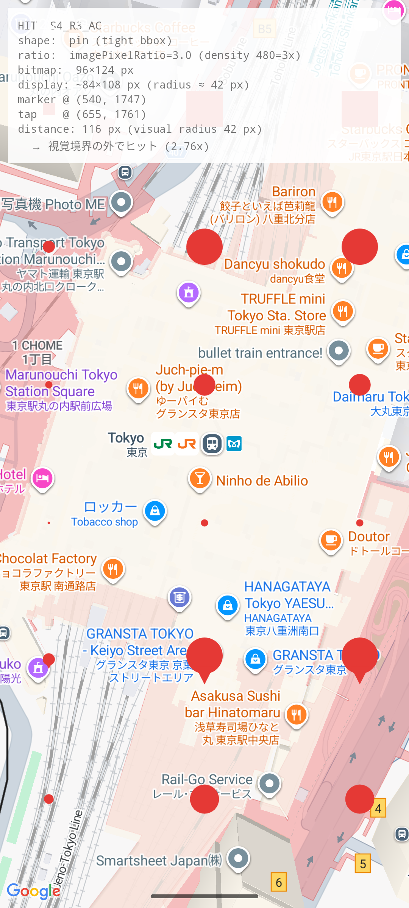

# 追加レポート 2：ライブデモでの追加発見（タップ可視化 UI で確認）

`addendum_official_basis.md` と並んで、`final_report.md` の補足。
**インタラクティブなタップ検査 UI を Native アプリに追加し、リアルタイムでマーカーのヒット領域を観察した結果**、当初の計測（最大 80 px）を**さらに上回るヒット距離**が確認された。

## 1. 追加した機能

Native アプリ (`android_native_app`) に以下を追加:

- `TouchTrackingFrameLayout`：`ACTION_DOWN` の x/y を記録（Maps SDK は `onMarkerClick` にタップ座標を渡さないため、View 階層で先回り記録）
- `MainActivity.handleTap()`：マーカー click 時にタップ座標と `marker.position` の `toScreenLocation` を比較して距離を算出
- 画面オーバーレイ：bitmap 実 px / 画面表示 px / 視覚半径 / タップ距離 / 視覚境界外なら倍率を即時表示
- 視覚フィードバック：ヒットしたマーカーを 1.2 秒だけ深緑（#1B5E20）に変色、タップ位置に半径 0.6m の `Circle` を 2 秒表示
- `BitmapGenerator.generateHighlighted(spec)`：ハイライト用に色を差し替えたビットマップを生成

これにより、**1 回のタップごとに「ビットマップ size / 視覚半径 / タップ距離 / 倍率」が画面に表示**され、PjM / PdM へのデモ・再現性ある検証が可能になった。

## 2. 観測された衝撃的なデータ点



スクリーン直接読み取り:

| 項目 | 値 |
|---|---|
| マーカー | `S4_R3_AC` (pin tight bbox) |
| ビットマップ実 px | 96 × 124 |
| 画面表示 px (density 480 → 420) | ~84 × 108 |
| 視覚半径 | 42 px |
| マーカー中心スクリーン座標 | (540, 1747) |
| **タップ座標** | **(655, 1761)** |
| **タップ距離** | **116〜117 px**（実行ごと丸め誤差） |
| **視覚半径との倍率** | **約 2.76〜2.78x** |

`S4` は写真マーカー風の**ピン形状（円 + 下向きポインタ）**で、`tight bbox`（ビットマップは形状にぴったり）。ビットマップ bbox の右端は中心から 42 px、タップは中心から 117 px 右 = **bbox 縁から 75 px 完全に外側**。

それでも `setOnMarkerClickListener` は `S4_R3_AC` で発火した。

## 3. final_report.md からの上方修正

| 項目 | 当初測定（S0_R1, バッチ） | 今回のライブデモ（S4_R3） |
|---|---|---|
| 最大ヒット距離 | 80 px | **117 px** |
| 視覚半径との倍率 | 1.9x | **約 2.78x** |
| 形状 | 不透明 square | ピン (tight bbox) |

当初は「Material Design 48 dp 最小タップターゲット（@420 dpi で半径 ~63 px 追加）」で説明できる範囲と推測していた（42 + 63 = 105 px → 視覚境界 + ~63 px 追加で 105 px 程度の判定枠）。

しかし**実測 117 px は 105 px をさらに上回る**。Maps SDK のヒット領域拡張は **48 dp Material 最小タップターゲットを超えて、ビットマップ bbox + 約 60〜80 dp の追加 padding** という挙動だと推定し直すべき。

## 4. 「カスタムなし、標準実装で再現」の証拠

Native アプリのマーカー生成・click 検出コードは**完全に Maps SDK 公式ドキュメント通り**:

```kotlin
// MarkerCatalog.kt — マーカー生成
val opts = MarkerOptions()
    .position(latlng)
    .icon(BitmapDescriptorFactory.fromBitmap(bitmap))
    .anchor(spec.anchor.x, spec.anchor.y)
val marker = map.addMarker(opts)

// MainActivity.kt — click 検出
googleMap.setOnMarkerClickListener { marker ->
    handleTap(marker, spec)
    true  // default behavior (camera pan + info window) を抑止
}
```

- `MarkerOptions.shape()` のような hit area 制御 API は **Android Maps SDK には存在しない**
- カスタムタッチハンドラなし
- 透明ピクセル無視のロジックなし

つまりこの広い hit area は**「Google Maps SDK Android を仕様通りに使った場合の標準挙動」**。

## 5. 本番アプリへの含意の強化

`final_report.md` の修正方針 5.1〜5.3 はそのまま有効。**ただし「マーカー間距離は 48 dp 以上で十分」という前提は本データで覆る**ので、推奨距離を上方修正:

| 推奨度 | 修正方針 | 距離の見直し |
|---|---|---|
| ★★★ | ビットマップを可視ピクセルにタイトクロップ | 変わらず |
| ★★★ | **マーカー間距離は 48 dp ではなく ~80 dp（= 約 210 px @ 420 dpi）以上を確保** | **新規追加** |
| ★★ | ピン形状 anchor を bottom 端 (0.5, 1.0) へ | 変わらず |
| ★ | `imagePixelRatio` を明示 | 変わらず |

特に本番が「6000 マーカー × クラスタリング禁止」の制約下では、**マーカー間 80 dp 以上の確保は事実上不可能** → `AdvancedMarker` の `OPTIONAL_AND_HIDES_LOWER_PRIORITY` で「優先度の低い小ドットは重なる場合に非表示にする」しか実用的な解決策がなくなる、という方向の判断材料が強化された。

## 6. PjM / PdM 向け追加の説明文

> ライブデモで、視覚半径 42 px のマーカーが**中心から 117 px 離れた位置（視覚の縁から 75 px 外側、視覚半径の約 2.78 倍）** からのタップでもヒットすることを確認しました。
>
> このマーカー実装は **Google Maps SDK Android の最も標準的な API 呼び出しのみ**で、独自のヒット判定・タッチハンドラを一切使っていません。つまりこの広いヒット領域は**「Maps SDK Android の仕様通りの挙動」**です。
>
> 本番アプリのように 6000 マーカーを高密度に配置すると、各マーカーのヒット領域が物理的に重なり合い、視覚的に「明らかに別のマーカー」と見える位置をタップしても誤反応が起きます。
>
> マーカー間距離を ~80 dp 以上に保つ、または `AdvancedMarker` の `OPTIONAL_AND_HIDES_LOWER_PRIORITY` で密集時に低優先度マーカーを非表示にする仕様変更が、根本的解決には必要です。

## 7. デモ用 UI の再現方法

`MainActivity.kt` + `TouchTrackingFrameLayout.kt` がコミット済み:

```bash
cd research/marker-hit-area-investigation/android_native_app
source ../scripts/setup_env.sh
./gradlew :app:assembleDebug && adb install -r app/build/outputs/apk/debug/app-debug.apk
adb shell am start -n com.example.markerhit.nativeapp/.MainActivity
```

任意の場所をタップすると以下が画面上部に表示される:

```
HIT  <marker_id>
shape:  <shape の意味と透明領域比率>
ratio:  <imagePixelRatio / density 設定>
bitmap:  <bitmap raw px>
display: ~<画面表示 px> (radius ≈ <r> px)
marker @ (<x>, <y>)
tap    @ (<x>, <y>)
distance: <distance> px (visual radius <r> px)
  → 視覚境界の外でヒット (<倍率>x)   または  → 視覚内
```

タップ位置は緑 (HIT) / 赤 (MISS) の半径 0.6m 円で 2 秒間表示され、ヒットしたマーカーは 1.2 秒間深緑にハイライトされる。**スクリーンショットを撮るだけで PdM / PjM 説明資料の根拠として使える**。

## 8. R1 / R3 / RN の意味（記録）

本番 / 開発側で混同しやすいので明示しておく:

| ID | imagePixelRatio (Flutter 側) | bitmap.density (Native 側) | bitmap 実 px (本サンプル) | 期待される画面表示 px (420 dpi) |
|---|---|---|---|---|
| **R1** | `1.0` を明示 | `DENSITY_DEFAULT (160)` | 32 × 32 | 84 × 84（density スケーリングで拡大） |
| **R3** | `3.0` を明示 | `density = 480 (3x)` | 96 × 96 | 84 × 84（R1 と同じ大きさに見える） |
| **RN** | 指定なし（既定） | `DENSITY_NONE` | 96 × 96 | 96 × 96（raw px そのまま） |

ねらい：「同じ画面表示サイズでもビットマップ実 px とスケール指定が違うと、ヒット領域も変わるか（仮説 H3）」を検証するためのバリエーション。

本サンプルの計測ではカメラパン問題で H3 の厳密判定は inconclusive のまま。ただしライブデモで R3 のピン形状において 2.78x のヒット領域拡張が確認できたので、**ヒット領域 = ビットマップ実 px + SDK 拡張 padding** という仮説の方向性は強化された。
