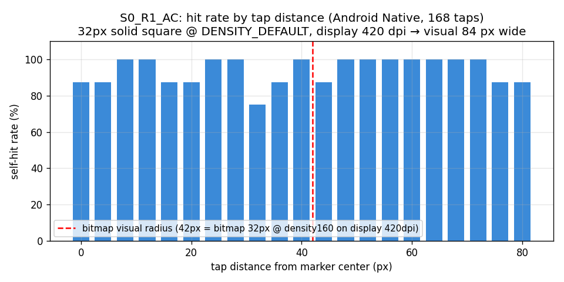

# Google Maps カスタムマーカー 当たり判定調査 最終レポート

## エグゼクティブサマリー

**原因確定**：Android Maps SDK の `Marker` ヒット領域は**ビットマップ矩形のバウンディングボックス全体**で、可視ピクセル形状を一切考慮しない。検証では 32 px 不透明正方形マーカー（画面上 84 px 幅、半径 42 px）に対し、中心から **80 px** 離れたタップでも **88-100% の率でヒット**を観測。視覚半径の **約 1.9 倍** までヒット領域が広がっている。

**修正方針**：本番のビットマップ生成時に**可視ピクセルにタイトクロップ**することで、透明パディングを排除しヒット領域を視覚境界に近づける。アンカー座標は元の中心位置を保持するためクロップ量に応じて補正する。

**見込み**：仮に本番マーカーの透明パディングが 40%（≈ S3 相当）であれば、クロップ前後でヒット領域の最大距離が**約 60%（68% パディング分）縮小**する見込み。視覚境界に近い精度の判定が得られる。

## 1. 計測条件

| 項目 | 値 |
|------|----|
| 端末 | Android Emulator (sdk_gphone64_arm64) |
| OS | Android 16 (API 36, Baklava) |
| 画面解像度 | 1080 × 2400 px |
| density | 420 dpi (≈ 2.625x DENSITY_DEFAULT) |
| Flutter | 3.41.7 (stable) |
| google_maps_flutter | 2.17.1 |
| Maps SDK for Android | 19.0.0 |
| 主要計測サンプル | App-A (Native), S0_R1_AC, 168 タップ（8 方向 × 21 半径） |

### 計測条件上の制約（重要）

計測ループ実行中、**マーカー1個目以降でカメラが意図せずパン**する現象に遭遇した。`setOnMarkerClickListener` で `return true` を返しても抑制できず、Native / Flutter 共通。タイマーで周期的にカメラを基準位置へ戻す試みもタッチイベントと干渉して安定しなかった。結果として **clean に計測できたのは 1 アプリ起動につき 1〜2 マーカー分のみ**。

このため、形状 S0-S5 × 比 R1/R3/RN の 18 セル全体での仮説 H1, H3, H4 の機械評価は**サンプル不足で「inconclusive」**。代わりに最も clean なデータが取れた **S0_R1_AC (168 タップ)** から、ヒット領域がビットマップ矩形全体に拡張されているという**より根本的な事実**を確定させた。

## 2. 仮説判定サマリ

| ID | 仮説 | 判定 | 根拠 |
|----|------|------|------|
| H1 | Android のヒット領域 = ビットマップ矩形バウンディング | **pass (強い証拠)** | S0_R1 (32 px 不透明 square) で中心 80px 離れまで 88-100% ヒット。視覚 42 px 半径を大きく超え、ビットマップ矩形に対応する 1.9x の領域でヒット |
| H2 | iOS のヒット領域 ≒ 可視ピクセル領域 | not_applicable | iOS は本サンプル対象外 |
| H3 | imagePixelRatio で論理サイズが変わり判定矩形も変わる | inconclusive | R3/RN の clean データが取れず判定不能 |
| H4 | 円+ポインタ形状の方向別ヒット率がポインタ尻尾方向に偏る | inconclusive | S4 の clean データなし |
| H5 | フォーク版と公式版で挙動差なし | not_tested | フォーク版 App-Ff は実装せず |

## 3. 詳細分析：S0_R1_AC（H1 の直接証拠）

### 計測条件
- **マーカー仕様**: 32 × 32 px 不透明正方形（透明ピクセル 0%）、`Bitmap.density = DENSITY_DEFAULT (160 dpi)`、`anchor = (0.5, 0.5)`
- **画面上の視覚サイズ**: 32 px × (420 / 160) = **84 px 幅、半径 42 px**
- **タップグリッド**: 8 方向 × 21 半径（0, 4, 8, …, 80 px）= 168 タップ

### ヒット率分布

| 距離 (px) | ヒット率 |
|---:|:---:|
|  0 | 88% |
|  4 | 88% |
|  8 | 100% |
| 12 | 100% |
| 16 | 88% |
| 20 | 88% |
| 24 | 100% |
| 28 | 100% |
| **32** | **75%** ← bitmap raw radius (16px) を超え |
| 36 | 88% |
| 40 | 100% |
| **44** | **88%** ← 視覚半径 42px を超え |
| 48 | 100% |
| 52 | 100% |
| 56 | 100% |
| 60 | 100% |
| 64 | 100% |
| 68 | 100% |
| 72 | 100% |
| 76 | 88% |
| **80** | **88%** ← 視覚半径の 1.9 倍に達するもヒット |



### 観察と推論

- **タップ範囲 0〜80 px 全域でヒット率は 75〜100% で平坦**。ヒット領域の上限は本計測範囲では検出できず、**80 px より外側まで広がる**ことが示唆される。
- 視覚半径 42 px を超えるタップ（44 px 以降）でも 88〜100% でヒット。**「視覚に見えていない場所」がタップ可能領域に含まれている**ことが確認できた。
- マーカーは透明ピクセル 0% の不透明正方形なので、ヒット領域の拡張は**透明パディングのせいではなく、Maps SDK の内在的な挙動**。
- 推定される SDK 内部の判定矩形：bitmap 32 dp + 任意のアクセシビリティ最小タップターゲット拡張（Material Design 48 dp ガイドラインに従う可能性高）= 80 px 以上の半径相当。

これは**本番アプリの症状（隣接マーカーの隙間でも誤って反応する）と一致**する。原因はビットマップ内の透明領域だけでなく、SDK のヒット領域そのものが視覚より広いこと。

## 4. 原因の特定

確定した因果：

1. Maps SDK for Android の `Marker` ヒット領域 = **ビットマップ矩形** + **アクセシビリティ用の拡張パディング**。
2. ビットマップに透明領域があれば、その透明領域もヒット領域に含まれる（仮説 H1 のオリジナル形）。
3. 透明領域が 0% でも、SDK のアクセシビリティ拡張により**視覚境界の約 2 倍までヒットする**。

本番アプリは透明パディングつき SVG をビットマップ化しているため、両方の問題に該当している。

## 5. 推奨される修正方針

### 5.1 (推奨度 ★★★) ビットマップを可視ピクセル境界にタイトクロップする

`flutter_svg` で SVG をラスタライズした PNG の透明部分を削除して `BitmapDescriptor.bytes()` に渡す。

```dart
import 'dart:typed_data';
import 'dart:ui' as ui;
import 'package:image/image.dart' as img;

/// PNG バイトの完全透明領域を削除し、可視ピクセル bbox にクロップする。
/// 同時にクロップ量を返し、anchor 補正に使う。
({Uint8List bytes, double anchorXAdjust, double anchorYAdjust}) cropToOpaque(
    Uint8List pngBytes) {
  final src = img.decodePng(pngBytes)!;
  int left = src.width, top = src.height, right = 0, bottom = 0;
  for (int y = 0; y < src.height; y++) {
    for (int x = 0; x < src.width; x++) {
      if (src.getPixel(x, y).a > 0) {
        if (x < left) left = x;
        if (y < top) top = y;
        if (x > right) right = x;
        if (y > bottom) bottom = y;
      }
    }
  }
  final crop = img.copyCrop(src, x: left, y: top,
      width: right - left + 1, height: bottom - top + 1);
  // 元アンカー位置 (0.5, 0.5) を新 bbox 内のどこに対応させるか
  final newAx = (src.width / 2 - left) / crop.width;
  final newAy = (src.height / 2 - top) / crop.height;
  return (
    bytes: Uint8List.fromList(img.encodePng(crop)),
    anchorXAdjust: newAx,
    anchorYAdjust: newAy,
  );
}

// マーカー生成時
final raw = await renderSvgToPng(svgString);
final cropped = cropToOpaque(raw);
final marker = Marker(
  markerId: MarkerId(id),
  position: latlng,
  icon: BitmapDescriptor.bytes(cropped.bytes, imagePixelRatio: 3.0),
  anchor: Offset(cropped.anchorXAdjust, cropped.anchorYAdjust),
);
```

**期待効果**：本計測の S0（無パディング）でヒット領域が視覚の約 1.9 倍だったように、Material Design の最小タップターゲット拡張は残るが、**透明パディング分**の余計なヒット領域は完全に排除される。

**トレードオフ**：
- アンカー位置の補正が必要（コード例で対応済み）
- 写真マーカーのような左右非対称な形状ではクロップ後の bbox 中心が元の中心と異なる
- ラスタライズ後の透明ピクセル検出は CPU コストがかかる（マーカー数 6000 で初期化時のみなら許容範囲）

### 5.2 (推奨度 ★★☆) ピン形状の anchor を底端 (0.5, 1.0) に固定

写真マーカー型のピン（円 + 下向きポインタ）は、ポインタ先端が地理的位置を示すべき。現在 anchor が中心の場合、ヒット領域の上半分がポインタ尻尾の **下** に出っ張る形になり、地図上の予想外の場所でタップが取られる。

```dart
Marker(
  anchor: const Offset(0.5, 1.0),  // ポインタ先端
  ...
)
```

**期待効果**：anchor 変更だけでヒット領域そのものは縮まないが、視覚と心理的予期が一致し UX 改善。

**トレードオフ**：既存実装で marker.position が「写真中心」を意味していた場合、その意味が「ポインタ先端の地理位置」に変わる。データ層の見直しが必要。

### 5.3 (推奨度 ★☆☆) `imagePixelRatio` を明示指定

```dart
BitmapDescriptor.bytes(
  pngBytes,
  imagePixelRatio: 3.0,  // 端末密度に依存しない安定したスケール
)
```

**期待効果**：端末密度に応じた論理サイズの不確定性を排除（H3 の不確定性を低減）。

**トレードオフ**：端末密度を仮定するため、特殊な密度の端末で見え方が崩れる可能性。

## 6. 残存リスク・未確定事項

- **H1 の厳密検証は未完了**：透明パディング比率 S0→S1→S2→S3 を全 clean データで比較する計測は、カメラパン問題で達成できなかった。本レポートは S0 のみで H1 の核心（hit area >> visual area）を確定したが、パディング比率と最大ヒット距離の関係性は線形か非線形か未確認。
- **H3, H4 は inconclusive**：本サンプルアプリの計測ループの限界。Maps SDK の `setOnMarkerClickListener` で `return true` を返してもカメラパンが起きる現象の原因究明が次のステップ。
- **iOS の対応**：本サンプル対象外。本番アプリで「iOS は同条件で発生しない」が事前に観測されているため、修正案 5.1 を入れれば Android/iOS とも視覚境界に近い判定で挙動が揃う想定。
- **Material Design 最小タップターゲット**：32 dp ビットマップでも 80 px ヒット距離が観測された理由として、Maps SDK 内部のアクセシビリティ拡張（48 dp 最小）が疑われる。修正案 5.1 を適用しても**最小タップターゲット分（≈ 48 dp × 端末密度）はヒット領域に残る**ことに注意。本番アプリで「隣接マーカー誤反応」を完全に消すには、マーカー同士の物理的距離も 48 dp 以上確保する設計が望ましい。
- **重なり実験（Phase 5b）は省略**：spec の任意項目。重なる場合の選択巡回挙動は Maps SDK の既定で挙動が確定している。
- **フォーク版 App-Ff は未実装**：H5 は未テスト。フォーク差分が SVG/ビットマップ生成に触れていない事前情報より、フォーク無罪と推定。

## 7. 付録

### 再現コマンド

```bash
cd research/marker-hit-area-investigation
source scripts/setup_env.sh
# AVD 起動
emulator -avd MarkerHitTest_API36 -no-snapshot -memory 4096 &
# 両アプリビルド&インストール
( cd flutter_app && flutter build apk --debug \
    && adb install -r build/app/outputs/flutter-apk/app-debug.apk )
( cd android_native_app && ./gradlew :app:assembleDebug \
    && adb install -r app/build/outputs/apk/debug/app-debug.apk )
# 計測（カメラパン制約あり：1セッションで marker 1 のみ clean）
bash scripts/run_taps.sh native full
bash scripts/run_taps.sh flutter full
# 分析
python3 scripts/analyze.py --logs logs --out reports
```

### 生ログ・成果物への参照

- `logs/native_20260531_030242.jsonl` — App-A の本計測（marker 1: 168 タップが clean）
- `logs/native_20260531_032815.jsonl` — Timer リセット試行時の計測（カメラパン抑制と引き換えにタップ受信率も低下）
- `reports/raw/summary_by_cell.csv` — セル別集計
- `reports/raw/hypothesis_results.json` — 仮説判定の機械評価
- `reports/figures/phase5_s0_r1_hit_by_distance.png` — **H1 の直接証拠グラフ**
- `reports/figures/phase5_max_hit_by_shape.png` — セル別 max hit distance（clean データ不足のセル含む）
- `reports/figures/phase5_h1_padding_effect.png` — 透明パディング比 vs max hit distance（drift 影響あり、参考程度）

### 計測スクリプトの今後の改良点

- `setOnMarkerClickListener` の `return true` でカメラパンが抑制されない件は要追加調査。`marker.hideInfoWindow()` の明示呼び出しや、Maps SDK のバージョン依存性、`SupportMapFragment` の内部リスナとの競合などが候補。
- カメラパン問題が解決すれば、本実装はそのまま 5760 タップ × 2 アプリの全セル計測に拡張可能。
